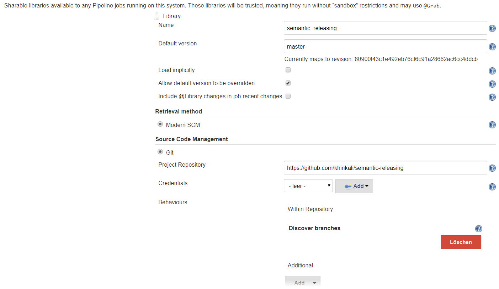

# Semantic Releasing in Jenkins
Semantic Releasing checks your git commits  since your last git tag for 
specific markers and sets the the version based on these markers. Your commits 
have to start with `[API]` or `[FEAT]`, any other commit results in an incremented 
bug version.
* `API` defines a change to the API which is a breaking change therefore the
major version has to be incremented.
* `FEAT` defines a new feature therefore the minor version has to be incremented.
 
It's possible to change these markers.
## Setup Jenkins
Go to `http://YOUR_JENKINS/configure` and make the following settings:


## Include Semantic Releasing in your Jenkinsfile
```
...
@Library('semantic_releasing')_
...
env.VERSION = semanticReleasing()
```
### Change the markers for the major and minor version
You can simply pass the list with your markers to the function call.
```
...
@Library('semantic_releasing')_
...
env.VERSION = semanticReleasing(['MAJOR', 'BIG'],['MINOR', 'SMALL'])
```
## Create a release
If you're using [GitHub](https://github.com) then you can include automated
releases as well.  
You just have to pass the version, GitHub account name, GitHub repository name and the GitHub token with
rights to the repository.
```
withCredentials([usernamePassword(credentialsId: 'github-api-token', passwordVariable: 'GITHUB_TOKEN', usernameVariable: 'GIT_USERNAME')]) {
    gitHubRelease(env.VERSION, 'khinkali', 'sink', GITHUB_TOKEN)
}
```